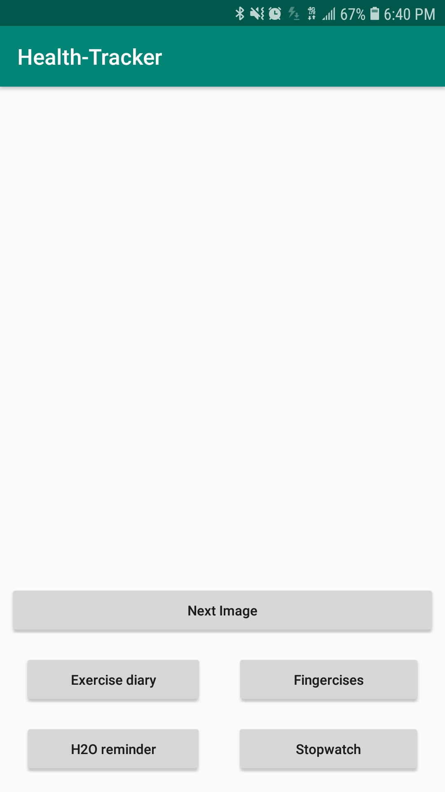
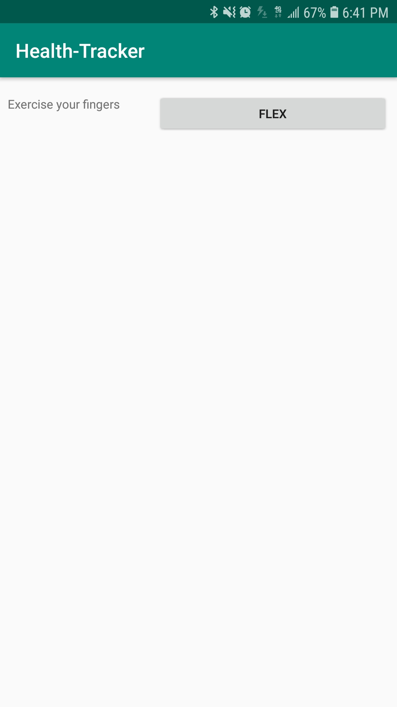
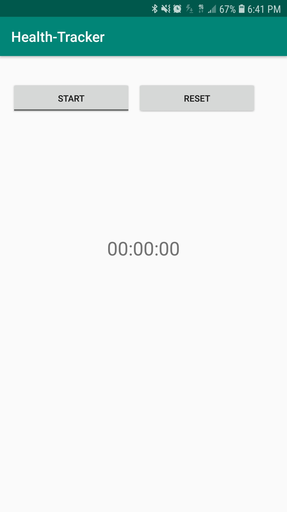
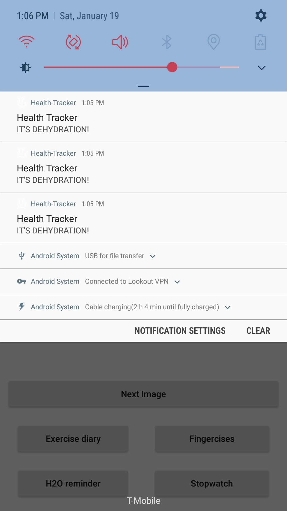

# Health-Tracker
An Android app that will be the focus of all of the work for the second half of the Java course: a health tracker app.
While we’re starting small, the features that will be built will carry over into the next several labs.

[Activity screenshots](#activity-screenshots)

### Day 1 - Lab 26: Android fundamentals

1. **Finger Exercises**
* One key part of health is building finger strength and endurance. On the main page, display a number and a button.
* The number should increase when the button is clicked.
* Stretch goal: the app should show encouraging messages as the user passes milestones in their button-clicking (perhaps a message at every 10 clicks, and serious props at every 50).

2. **Stopwatch** 
__*NOTE*__: This feature has been redacted from the task list due to its difficulty

* Still on the main page, add a stopwatch. 
* Have a button to [Start/Pause]. The start/pause button should toggle between saying “start” and “pause.”
* Have a [Reset] button for the clock. You should only be able to reset when the stopwatch is paused.
* Have the view update as fast as possible while still leaving the buttons responsive.
* Display the clock as 0:00:00.000 so it should be able to track up to 9 hours, 59 minutes, 59 seconds and 999 milliseconds.
* You can use System.currentTimeMillis() to track the start and current time at the millisecond-level.    
    
3. **Inspiring Image Carousel**
At the top of the main page, I want to inspire the users with images of the type of person they can become.

* Display an image with a caption below it. (The caption should NOT be part of the image; it should be text.)
* Allow users to cycle through images and read the captions
    * Pressing next should go to the next image and its caption, pressing prev should go back.
* The app should display a (1/N), (2/N) … indicator so users know how many items are in the list.
* Your app must use a class to model the images and their captions.
* Use the class to manually instantiate each unique item.
* Add all of the items to an array.
* Your app should use the array of image objects to cycle through what it’s showing.
    
### Day 2 - Lab 27: Intents, notifications, & XML

Yesterday, all of your app’s features were on the home page. Let’s clear up that homepage and allow users to visit individual pages for those various features.

1. **Move your Finger Exercises and Stopwatch into their own pages of your app.**

* Add buttons on the homepage to link to those pages
* Ensure that the user can use the back button on the device to return to the app homepage. (It’s good practice to include some sort of back button on the page as well.)
    
2. **Create a new activity for Notifications.**

* Allow users to set up reminders to drink water
* They should appear every 2 hours in the notification bar. (For testing, you might want to shorten this to 15 or 30 seconds.)
    
3. **Styling**

* Apply consistent styling across the various Activities in your app.
* Make sure they have a consistent look and feel, and that buttons are in similar locations on each screen.

### Day 3 - Lab 28: Layouts, databases, & listviews

1. **Database setup**
* Set up a database to contain Exercise data.
    * Each Exercise should have:
        * a title
        * a quantity
        * a description
        * & a timestamp.
        
2. **Testing**
* For testing, add a single Exercise to the database.
* Write tests for:
   * Adding an exercise
   * Retrieving exercises from the database
   * Any logic about turning an exercise into its String representation
   
3. **Diary view/activity**
* Add a new Activity to hold the Exercise Diary.
    * In that view, display all entries from the Exercise database in a ListView. (At this point, that should show a single row.) Make sure that Exercise looks reasonable.
   
4. **Adding to the Exercise Diary**
* At the top of the Exercise Diary activity, add a form that allows a user to enter data about an exercise.
* When they hit submit, the information about that exercise should be stored in the database and displayed in the ListView. You can choose how the timestamp works: 
    * either let the user enter when they completed the exercise
    * or use the time when they hit submit on the form.      

### Day 4 - Lab 29: Testing, Espresso, & permissions

1. 

### Day 5 - Lab 32: Layouts, databases, & listviews again

1. 

### Day 6 - Lab 33: Threading, asynch, web

1. 

### Activity screenshots

#### Main activity

#### Fingercises activity

#### Stopwatch activity

#### Notifications

